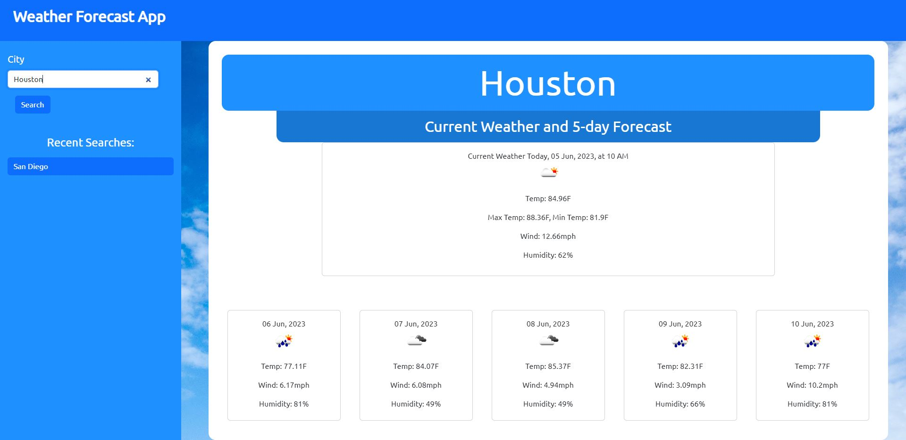

# <Your-Project-Title>

## Description

Provide a short description explaining the what, why, and how of your project. Use the following questions as a guide:

- A simple and functional weather app that can get current weather data and a 5-day forecast from a city.
- With this application, you can find the current weather in your city, or a city where you would be traveling to.
- Weather Data and Geolocation is provided by OpenWeatherMap's API.
- This weather app has greatly furthered my knowledge in RESTful APIs, and increased my proficiency in Bootstrap and JavaScript.

## Installation

To access this Weather Application, you can [Click on this Link](https://epicasino.github.io/Weather-App/). Deployment provided by GitPages.

## Usage

**When first visiting the website, you will be presented with the following image. By design, the website will default to San Diego for weather upon refresh/initialization**

**On the left of the website, there is a searchbar where you can input a city name. In this example, we will choose the city of Houston, Texas. When pressing the "search" button, you will be presented with the searched city's weather & forecast.**

**Upon refresh, you will be defaulted back to San Diego's weather. This is by design in the code, however, your recent city searches will show up under the "recent searches" text on the sidebar.**

## Credits

Weather data provided by [OpenWeatherMap](https://openweathermap.org/).

## License

MIT License

Copyright (c) 2023 Ray Badua

Permission is hereby granted, free of charge, to any person obtaining a copy
of this software and associated documentation files (the "Software"), to deal
in the Software without restriction, including without limitation the rights
to use, copy, modify, merge, publish, distribute, sublicense, and/or sell
copies of the Software, and to permit persons to whom the Software is
furnished to do so, subject to the following conditions:

The above copyright notice and this permission notice shall be included in all
copies or substantial portions of the Software.

THE SOFTWARE IS PROVIDED "AS IS", WITHOUT WARRANTY OF ANY KIND, EXPRESS OR
IMPLIED, INCLUDING BUT NOT LIMITED TO THE WARRANTIES OF MERCHANTABILITY,
FITNESS FOR A PARTICULAR PURPOSE AND NONINFRINGEMENT. IN NO EVENT SHALL THE
AUTHORS OR COPYRIGHT HOLDERS BE LIABLE FOR ANY CLAIM, DAMAGES OR OTHER
LIABILITY, WHETHER IN AN ACTION OF CONTRACT, TORT OR OTHERWISE, ARISING FROM,
OUT OF OR IN CONNECTION WITH THE SOFTWARE OR THE USE OR OTHER DEALINGS IN THE
SOFTWARE.
